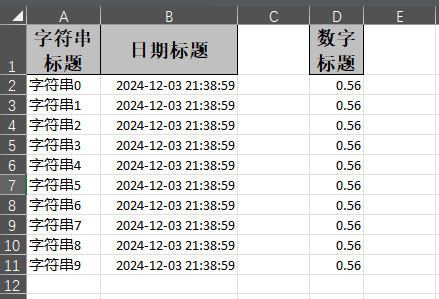

# POJO
本章节将介绍通过设置 POJO 来写入。

## 根据参数只导出指定列

### 概述
通过设置列名集合动态选择要导出的列，支持忽略列或仅导出特定列。

### 代码示例

忽略指定列

```java
@Test
public void excludeOrIncludeWrite() {
    String fileName = "excludeColumnFieldWrite" + System.currentTimeMillis() + ".xlsx";

    Set<String> excludeColumns = Set.of("date");
    FastExcel.write(fileName, DemoData.class)
        .excludeColumnFieldNames(excludeColumns)
        .sheet()
        .doWrite(data());
}
```

仅导出指定列

```java
@Test
public void excludeOrIncludeWrite() {
    String fileName = "includeColumnFiledWrite" + System.currentTimeMillis() + ".xlsx";

    Set<String> includeColumns = Set.of("date");
    FastExcel.write(fileName, DemoData.class)
        .includeColumnFiledNames(includeColumns)
        .sheet()
        .doWrite(data());
}
```

### 结果


---

## 指定写入的列顺序

### 概述
通过 `@ExcelProperty` 注解的 `index` 属性指定列顺序。

### POJO类
```java
@Getter
@Setter
@EqualsAndHashCode
public class IndexData {
    @ExcelProperty(value = "字符串标题", index = 0)
    private String string;
    @ExcelProperty(value = "日期标题", index = 1)
    private Date date;
    @ExcelProperty(value = "数字标题", index = 3)
    private Double doubleData;
}
```

### 代码示例
```java
@Test
public void indexWrite() {
    String fileName = "indexWrite" + System.currentTimeMillis() + ".xlsx";
    FastExcel.write(fileName, IndexData.class)
        .sheet()
        .doWrite(data());
}
```

### 结果


---

## 不创建对象的写入

### 概述
直接使用 `List<List<String>>` 定义头和数据写入，无需创建实体类。

### 代码示例
```java
@Test
public void noModelWrite() {
    String fileName = "noModelWrite" + System.currentTimeMillis() + ".xlsx";

    FastExcel.write(fileName)
        .head(head()) // 动态头
        .sheet("无对象写入")
        .doWrite(dataList());
}

private List<List<String>> head() {
    return Arrays.asList(
        Collections.singletonList("字符串标题"),
        Collections.singletonList("数字标题"),
        Collections.singletonList("日期标题"));
}

private List<List<Object>> dataList() {
    List<List<Object>> list = new ArrayList<>();
    for (int i = 0; i < 10; i++) {
        list.add(Arrays.asList("字符串" + i, 0.56, new Date()));
    }
    return list;
}
```

### 结果

